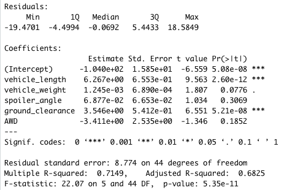
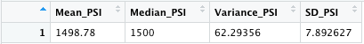
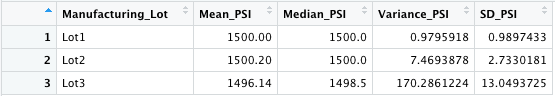
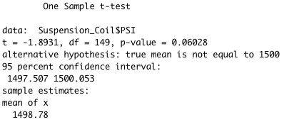
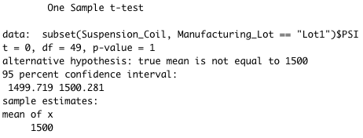
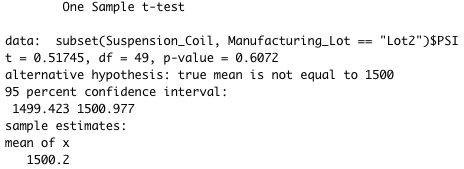
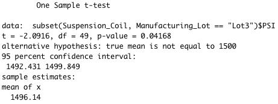

### Overview of the statistical analysis:

AutosRUs’ newest prototype, the MechaCar, is suffering from production troubles that are blocking the manufacturing team’s progress. AutosRUs’ upper management has called on Jeremy and the data analytics team to review the production data for insights that may help the manufacturing team.

In this challenge, the following were performed:

- Perform multiple linear regression analysis to identify which variables in the dataset predict the mpg of MechaCar prototypes.

- Collect summary statistics on the pounds per square inch (PSI) of the suspension coils from the manufacturing lots.

- Run t-tests to determine if the manufacturing lots are statistically different from the mean population.

- Design a statistical study to compare vehicle performance of the MechaCar vehicles against vehicles from other manufacturers. For each statistical analysis, you’ll write a summary interpretation of the findings.

### Results:

**Deliverable 1:** Linear Regression to Predict MPG:

Summary: *The MechaCar_mpg.csv dataset contains mpg test results for 50 prototype MechaCars. The MechaCar prototypes were produced using multiple design specifications to identify ideal vehicle performance. Multiple metrics, such as vehicle length, vehicle weight, spoiler angle, drivetrain, and ground clearance, were collected for each vehicle. Using R, a linear model was designed that predicts the mpg of MechaCar prototypes using several variables from the MechaCar_mpg.csv file.* 

Below is a short interpretation of the multiple linear regression results:

1. Which variables/coefficients provided a non-random amount of variance to the mpg values in the dataset?

*The data analysis result shows that the vehicle_weight, spoiler_angle, and AWD provided a non-random amount of variance to the mpg values in the dataset with the following p-value results: 0.0776, 0.3069, and 0.1852, respectively. Both vehicle_length and ground_clearance have the most random amount of variance with p-values of 2.60e-12 and 5.21e-08, respectively. Refer to image below.*

2. Is the slope of the linear model considered to be zero? Why or why not?

*The slope of the linear model is not zero since the p-value is 5.35e-11. refer to image below.* 

3. Does this linear model predict mpg of MechaCar prototypes effectively? Why or why not?

*As you can see from the image provided below, the multiple R-squared is about 71% (0.7149) which is the percent prediction of mpg values are correct. Also, the p-value is below the significance level of 0.05% therefore, this linear model is effective.*

Summary of the p-value and the r-squared value for the linear regression model:

**Deliverable 2:** Summary Statistics on Suspension Coils:

Summary: The MechaCar Suspension_Coil.csv dataset contains the results from multiple production lots. In this dataset, the weight capacities of multiple suspension coils were tested to determine if the manufacturing process is consistent across production lots. Using R, the following summary statistics table were created to show:

- The suspension coil’s PSI continuous variable across all manufacturing lots.

Total Summary:

- The following PSI metrics for each lot: mean, median, variance, and standard deviation.

Lot Summary:

1. The design specifications for the MechaCar suspension coils dictate that the variance of the suspension coils must not exceed 100 pounds per square inch. Does the current manufacturing data meet this design specification for all manufacturing lots in total and each lot individually? Why or why not?

*The current manufacturing data is meets the design specification based on total specification which shows a variance of 62.3 psi. However, if the variance is calculated for each lot, only lot 1 (0.98) and lot 2 (7.47) meets the design specification which is well below the PSI limit of 100 pounds. Lot 3 exceeded the limit, with a variance of 170.29*

**Deliverable 3:** T-Tests on Suspension Coils:

Summary: *Using R, t-tests were performed to determine if all manufacturing lots and each lot individually are statistically different from the population mean of 1,500 pounds per square inch.*

- t-test results across all manufacturing lots:

- t-test results for each lot:

Mfg. Lot 1

Mfg. Lot 2

Mfg. Lot 3

1. Briefly summarize your interpretation and findings for the t-test results. Include screenshots of the t-test to support your summary.

*For all manufacturing lots, the p-value of the suspension coil for PSI is 0.06 which is above the significance level of 0.05%. Therefore, the importance of finding is normal. When t-test is performed for each lot, the p-values for lot 1 (1) and lot 2 (0.61) are both above the significance level and therefore, the results are not statistically different from the mean population of 1,500 pounds per square inch. The p-value for lot 3 is 0.04 and therefore, it is statistically different from the mean population of 1,500 pounds per square inch.*

**Deliverable 4:** Study Design: MechaCar vs Competition:

Summary: *Write a short description of a statistical study that can quantify how the MechaCar performs against the competition. In your study design, think critically about what metrics would be of interest to a consumer: for a few examples, cost, city or highway fuel efficiency, horse power, maintenance cost, or safety rating.*

In your description, address the following questions:

- What metric or metrics are you going to test?
- What is the null hypothesis or alternative hypothesis?
- What statistical test would you use to test the hypothesis? And why?
- What data is needed to run the statistical test?

1. Horsepower refers to the power an engine produces and since most drivers wants faster cars, it might be worthwile to look into this when comparing how MechaCar performs against the competition. Another interest is fuel efficiency as lowering carbon footprint is important for the invironment and lowering cost is not a bad idea. 

2. A null hypothesis (H0)can be stated how it is not different from the competitor (is there a statistical difference?) and the alternative (Ha) is how it is different.

3. Data from the competitor's vehicles are needed in order to perform the t-test.

4. The population mean will be used to compare through the t-test.

